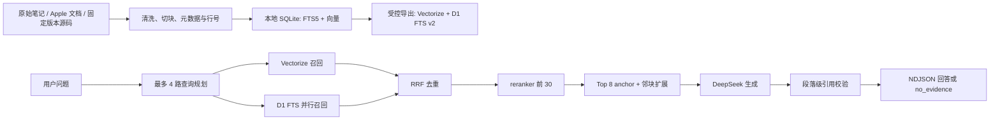

# iOS 知识库与引用式问答系统

最后核对：2026-09-10（本地代码与历史评测报告；生产状态以 `HANDOFF.md` 的 2026-09-07 记录为准）。

## 一句话定位

面向 iOS 学习与面试复盘的个人知识库：将自有笔记、Apple 公开资料和固定版本源码转为可检索证据，网页问答只在有可追溯材料时生成带段落引用的回答。

## 技术栈

- 本地建库：Python、SQLite、FTS5、sqlite-vec、jieba、bge-m3。
- 网站检索：Astro、Cloudflare Pages Functions、Workers AI bge-m3 embedding、Vectorize、两座 D1 FTS v2 数据库、Workers AI reranker。
- 生成与流式：DeepSeek V4 Flash、NDJSON；普通对话与知识问答在路由层分开。
- 测试与评测：Python `unittest`、Node 内置 test runner、静态检查、构建/链接/体积检查、无正文生产评测报告。

## 系统链路



## 证据与检索边界

- 本地库当前实测为 1,092,820 个文本块，其中 52,511 个向量化，数据库约 2,014.1 MB。该数字来自 2026-09-10 的 `uv run ioskb stats`。
- `objc4-source` 固定到 Apple 公开 `objc4-951.7`；CoreFoundation 为 `CF-1153.18-apple`，Apple libdispatch、Swift 开源实现、GNUstep 参照实现和第三方库均以独立来源类型保存。Swift/GNUstep 不作为 Apple 私有实现的证据。
- 源码地图只用于本地导航；模型生成的知识卡片与源码地图均被排除在最终问答和云端导出之外。
- 生产 Retrieval v2 的设计是 Vectorize 与两座 D1 FTS 并行召回、RRF 去重、可降级 reranker、邻块扩展，再由引用校验决定是否交付。无可靠 iOS 证据返回 `422 no_evidence`，不让通用模型伪造来源。
- 跨平台题必须检查两侧证据；用户明确限定“只从 iOS 侧”时才允许单侧说明，并要求在回答中写明边界。

## 稳定性、安全与可观测性

- 流式 API 使用 NDJSON 终结事件；本地待发布补丁 `3dd5617` 将收尾统一为幂等 `finish`，以保证每条流只有一个 `done` 或 `error`。
- 空流或正文前断流会独立超时并重试一次；无有效引用的知识回答退款并报 `invalid_citations`。
- 指标不保存问题正文或回答正文；生产评测报告只保留状态、模式、引用编号、来源元数据和长度。管理员来源预览受长度限制，普通用户不返回个人笔记正文或绝对路径。
- 资料镜像、Obsidian 笔记和学习资料只读；同步、导出、上传和发布分层，`sync --prepare-cloud` 仅生成本地包。

## 可重复验证

```bash
# 不读取令牌、不访问生产；确认审核资产与当前本地索引的发布门禁
uv run python scripts/run_production_eval.py --priority P0 --gate

# 对已有无正文报告离线重算指标，不访问网络
uv run python scripts/run_production_eval.py \
  --summarize-report data/evaluation-results/production-eval-key-cases-20260907.json

# 全量本地回归与本地索引快照
uv run python -m unittest discover -s tests -v
uv run ioskb stats
```

指标口径：`mode_accuracy` 比较预期和实际路由类别；no-evidence precision/recall/accuracy 只对已执行用例的 `422 no_evidence` 分类计算；`valid_citation_coverage` 是实际 knowledge 流中至少含一个范围内引用编号的比例；`expected_anchor_coverage` 是这些 knowledge 流中命中预期锚点的比例。它们评估路由和可追溯性，不衡量答案事实正确性或用户满意度。

## 已验证与限制

- 2026-09-07 的生产 P0 定向报告包含 5 例：3 例正确返回 `422 no_evidence`，1 例错误进入 knowledge，1 例没有 `done`。离线重算的 no-evidence 准确率为 60.00%，该结果用于暴露缺陷，不能表述为生产已全部修复。
- 更早的 31 例 P0 基线有 29 例实际执行、6 passed / 23 failed / 2 skipped；离线重算的 no-evidence 召回率为 10.00%。这证明评测器能够定位路由问题，不证明当前线上质量。
- 生产记录中的 Vectorize 55,635 条和 D1 FTS v2 合计 124,818 条是 2026-09-07 的既有验证快照；本地新增的源码分层融合尚未重新导出或发布，不能与生产数据混为一谈。
- `3dd5617` 已在隔离副本通过本地检索/API/格式/类型/构建验证，但尚未推送、合并或部署。发布前必须先把它与最新远端主线重新整合、重跑测试和定向生产评测。
- P0 门禁仍有 10 条人工复核阻断：`pem-000018` 至 `pem-000023` 的追问语境，以及 `pem-000028` 至 `pem-000031` 的平台/实验局限。不得删除 `manual_review_required` 来放行。
